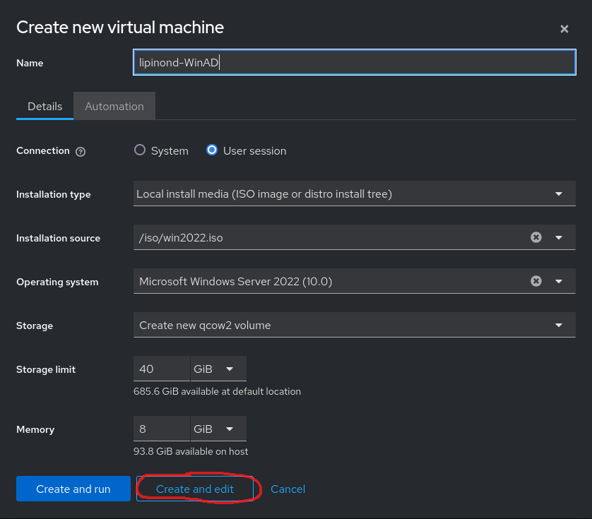
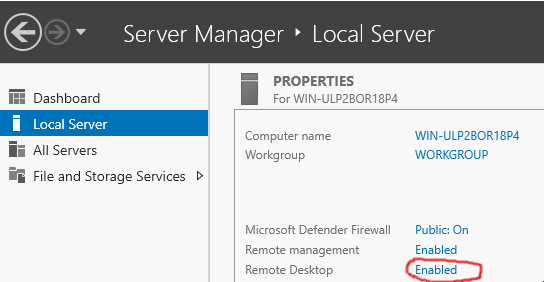

# AD join

## Theory
https://itconnect.uw.edu/tools-services-support/it-systems-infrastructure/msinf/other-help/faq/ad-terms/

Abreviations:

- AD - Active Directory
- OU - Organizational Unit
- DC - domain or domain controler


## AD Join only (common work)
0. Create snapshot of VM - REMOVE THE ISO!!!!!!
1. Install needful packages: 
    ```
    $ dnf install openldap-clients sssd realmd samba-common krb5-workstation oddjob oddjob-mkhomedir adcli
    ```
2. Add AD server as your DNS server (just temporarily by editing `/etc/resolv.conf`, comment all other nameservers if present)
3. Test connectivity to AD
    - user: **svcjoin**
    - pass: **Student1**
    ```
    $ ldapsearch -x -h 172.20.4.29 -p 389 -D "svcjoin@test.local" -W -b "ou=PROD,dc=test,dc=local" cn
    ```
4. Join client to AD
    ```
    $ realm join -U svcjoin TEST.LOCAL --computer-ou="ou=Systems,ou=PROD,dc=test,dc=local" --os-name="`uname -o`" --os-version="`uname -rsv`" --verbose
    ```
5. Review `/etc/sssd/sssd.conf` and comand `realm list`
6. Review `sssd` service and command `sss_cache`

### Configure access for users and groups
1. Test access
    ```
    ssh -l pepa@test.local <ip> (password: Student1)
    ssh -l svcjoin@test.local <ip>
    $ id pepa@test.local
    ```
2. Permit or deny users or groups
    ```
    $ realm permit -g <group1>
    $ realm permit -g linuxusers
    ```
3. Edit sssd config and decide if you want fully qualified names or short names 
    | parameter | user login |
    | --- | --- |
    | use_fully_qualified_names = True | user@domain.ltd |
    | use_fully_qualified_names = False | user |
    | fallback_homedir = /home/%u@%d | /home/user@domain.ltd |
    | fallback_homedir = /home/%u | /home/user |


## Steps to be done on Windows AD server (practice)
### 1. Preparation
1. Create new VM

    
2. Modify network of VM

    
3. Install Win 2022

    
4. Enable RDP

    
5. Get an IP and connect via RDP

### 2. Install AD role 
1. Enable AD feature
    - Follow: https://www.turbogeek.co.uk/how-to-install-active-directory-on-windows-server-2022/
    - Setup domain: `<lastname>.local`
    - The server will reboot
2. Enable Advanced Features in Active Directory Users and Computers

    
    

### 3. Create AD content
1. Create user `svcjoin` with password `Student1` in top level domain: `Users`. Set only "Password never expires"
    
2. Create OU=`LAB`
3. Create OU=`Servers` and OU=`Users` under `LAB`
5. Add permissions for `svcjoin` to create/delete computers in OU `LAB`

    
    
    
    
6. Create 2 groups in `OU=LAB,OU=Users`
    - `linuxadmins`
    - `linuxusers`
7. Create 2 users `OU=LAB,OU=Users`:
    - `admin1` with password `Redhat123`, member of `linuxadmins`
    - `user1` with password `Redhat123`, member of `linuxusers`

## Steps on the client linux server (practice)
### Join to AD
0. Revert snapshot
1. Install needful packages: 
    ```
    $ dnf install openldap-clients sssd realmd samba-common krb5-workstation oddjob oddjob-mkhomedir adcli
    ```
2. Add AD server as your DNS server (just temporarily by editing `/etc/resolv.conf`, comment all other nameservers if present)
3. Test connectivity to AD
    - Replace thing in `<>` accordingly to your setup, remove `<>`.
    ```
    $ ldapsearch -x -h <AD IP> -p 389 -D "svcjoin@<your domain>" -W -b "ou=LAB,dc=test,dc=local" cn
    ```
4. Join client to AD
    - Replace thing in <> accordingly to your setup, remove <>.
    ```
    $ realm join -U svcjoin <your domain> --computer-ou="ou=Servers,ou=LAB,dc=<domain>,dc=<ltd>" --os-name="`uname -o`" --os-version="`uname -rsv`" --verbose
    ```
5. Review `/etc/sssd/sssd.conf` and comand `realm list`

### Configure access for users and groups
1. Permit or deny users or groups
    ```
    $ realm permit -g <group1> <group2>
    $ realm permit -g linuxadmins linuxusers
    ```
2. Allow sudo access for group `linuxadmins@<your domain>` (utilize config in sudoers.d folder) 
3. Test access
    ```
    id user1@<your domain>
    ssh -l user1@<your domain> <ip>
    ssh -l admin1@<your domain> <ip>, try to switch to root via sudo
    ```
4. Change configuration of sssd so you do not have to write full domain for users
