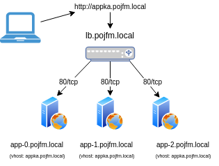

# Využití linuxového serveru v praxi

## Obsah
1. Pár slov o firmě, mne a teamu
2. Co je to server?
3. Nejčastější využití Linuxového serveru
4. Nejčastější využití Windows serveru
5. Správa serverů v 21. století
    - Infra as a code - terraform
    - Konfigurační management - Ansible
6. Praktická ukázka
    - Vytvoření 4 x VMs pomocí nástroje terraform a cloudinit
    - Vytvoření inventáře pro Ansible
    - Konfigurační management v praxi
        - security hardening 
        - nasazení webové aplikace
7. QA    

***

## 1. Pár slov o firmě, mne a teamu
### Tietoevry
- Tietoevry má hlavní sídlo ve Finsku a zaměstnává téměř 24 000 expertů v desítkách zemí.
- https://www.tietoevry.com/en/about-us/our-company/
- https://www.tietoevry.com/en/newsroom/all-news-and-releases/stock-exchange-releases/25/03/inside-information-tietoevry-to-sell-its-tech-services-business-to-funds-advised-by-agilitas-private-equity-llp-for-eur/

### O mně
- 6 let v Tietoevry
- 5 let v OKIN BPS
- 15+ let praxe s UNIXem

### Team - Server Management Linux Operations
- spravujeme cca 4500 UNIX serverů
- okolo 40 lidí v T2 a T3
- 80% RedHat, SUSE, (Oracle Linux)
- 20% HP-UX, Solaris, AIX
- cca. 250 fyzických Linux serverů
- virtuální platformy: vmware, hyper-v, proxmox, public-cloudy
- HPC - High Performance Computing

***

## 2. Co je to server?
Server - od slova `serve` (`slouzit, obslouzit, poskytovat`).

https://cs.wikipedia.org/wiki/Server

### Typy:

- [Tower servery](https://www.google.com/search?q=server+hp+ml&tbm=isch&ved=2ahUKEwjf-v_8xPn8AhXhmycCHR_BCiYQ2-cCegQIABAA&oq=server+hp+ml&gs_lcp=CgNpbWcQAzIGCAAQCBAeMgYIABAIEB4yBggAEAgQHjIGCAAQCBAeMgYIABAIEB4yBggAEAgQHjIGCAAQCBAeMgYIABAIEB4yCQgAEIAEEAoQGDoFCAAQgARQ9QlYkSRgqSZoAHAAeACAAUiIAbQCkgEBNZgBAKABAaoBC2d3cy13aXotaW1nwAEB&sclient=img&ei=9hbdY9-nE-G3nsEPn4KrsAI&bih=933&biw=1914&client=opera)
- [Rackové servery](https://www.google.com/search?q=server+hp+dl&client=opera&source=lnms&tbm=isch&sa=X&ved=2ahUKEwjJ1LvbxPn8AhX1QvEDHWCvBwUQ_AUoAXoECAEQAw&biw=1914&bih=933#imgrc=K_SlmMmE40SlrM)
- [Blade servery](https://www.google.com/search?q=server+hp+bl&tbm=isch&ved=2ahUKEwiXuIvrxPn8AhX2WqQEHcX9A1sQ2-cCegQIABAA&oq=server+hp+bl&gs_lcp=CgNpbWcQAzIGCAAQCBAeMgYIABAIEB4yBggAEAgQHjIGCAAQCBAeMgYIABAIEB4yBggAEAgQHjIGCAAQCBAeMgYIABAIEB46BAgAEEM6BQgAEIAEUJIHWN8NYPMPaABwAHgAgAFNiAHAApIBATWYAQCgAQGqAQtnd3Mtd2l6LWltZ8ABAQ&sclient=img&ei=0BbdY5eQLva1kdUPxfuP2AU&bih=933&biw=1914&client=opera)

### Historie UNIXu
- https://en.wikipedia.org/wiki/History_of_Unix
- https://en.wikipedia.org/wiki/Unix_wars

### Linuxové distribuce
- https://en.wikipedia.org/wiki/Linux_distribution

***

## 3. Nejčastější využití Linuxového serveru

- Development system
- Webový server (apache, nginx)
- Databázový server (Oracle, Mysql, DB2, MariaDB, psql)
- Aplikační server (php, java, python, C++)
- Síťově úložiště (NFS, SMB)
- DNS server
- Kontejnérový host (docker, podman, kubernetes)
- Virtualizační host (KVM, XEN)
- Vývojové prostředí (Vagrant)
- Síťový prvek (router, firewall)
- Automatizační nástroj (Ansible, Salt)
- AI compuete node

***

## 4. Nejčastější využití Windows serveru

- Doménový řadič
- Active Directory (ldap, GPO)
- Síťové úložiště (SMB)
- DNS server
- DHCP server
- IIS server

***

## 5. Správa serverů v 21. století

### Infrastructure as a code
- Připravím si definice VMs
- Vyrobím/zruším 1 nebo X serverů jedním commandem pomocí moderních nástrojů:
    - [terraform](https://en.wikipedia.org/wiki/Terraform_(software))
    - [cloud-init](https://cloudinit.readthedocs.io/en/latest/tutorial/qemu.html)
    - [packer](https://www.packer.io)
- Vše spravuji v kódu, nepíši nikde žádne příkazy, neklikám v GUI

### Configuration management
- není moderní opravovat věci, je jednodušší server smazat a vyrobit znovu (musím k tomu mít konfigurace)
    - [ansible](https://www.ansible.com)
    - [salt](https://saltproject.io)
- existují vyjímky 
- mit důležité věci, hardeningy, configy verzované někde u sebe (např. GIT)

***

## 6. Praktická ukázka
1. Create 4 empty VMs with some predefined configuration. Apply hardenings.
2. Deploy 1 loadbalancer
3. Deploy application appka.pojfm.local to 3 nodes
4. Access the app, test LB, reboots
5. Patching
6. Modify -> rerun configs

<p align="center">
  
</p>

***

## 7. Q&A

***

## 8. Thank you

```
                    Thank You for your attention!

                    Ondrej Lipina
                    Service Architect at Tietoevry

                    ondrej.lipina@tietoevry.com
                    https://github.com/OndraLipo

                                .~.
                                /V\
                               // \\
                              /(   )\
                               ^`~'^
```
