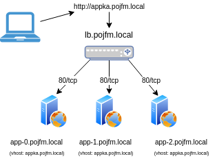

# Lab

## The design
We have a high utilized web application with load balancer.

<p align="center">
  
</p>

- `lb.<user>.local` (loadbalancer to balance traffic to the application nodes)
- `app[1-X].<user>.local` (unlimited number of application nodes containing same app content)

## Login to kvm host
```
ssh <user>@<ip>
```
password: `redhat`


## VM information
```
virsh list --all
virsh pool-list
virsh net-list
virsh domifaddr --source agent <domain>
virsh console <domain> (Ctrl + ])
```
## Terraform
(Infrastructure as a code)
### 0. Investigate module structure

```
cd terraform
cat main.tf
```
### 1. Plan and apply the configuration
```
terraform plan
terraform apply
```
### 2. Get IP address information
```
terraform apply -auto-approve -refresh-only 
```
## Ansible
(Configuration management)
### 0. Investigate ansible folder
```
cd -
cd ansible
ls -la
tree
```
### 1. Build the inventory from terraform state
```
python build-ans-inventory.py
ansible -m ping -i inventory.ini all
```
### 2. Modify the inventory for our needs
Create groups of servers per it's usage.
```
vim inventory.ini

...
[lb]

[apps]
...
```
### 3. Apply hardening on servers (optional)
```
ansible-playbook -i inventory.ini playbooks/hardening.yml
```
### 4. "The App"
#### 4.1 Modify the App URL/domain name
Replace the `<user>` with your username.
```
vim playbooks/deploy-applicaton-main.yml

...
  vars:
    http_host: appka.<user>.local
    http_port: 80
...
```
#### 4.2 Configure LB and feploy the App to the app node(s)
```
ansible-playbook -i inventory.ini playbooks/deploy-applicaton-main.yml
```
#### 4.3 Test the functionality
Open webrowser and put to address bar IP of your LB or update the `/etc/hosts` (optional) with domain name.

Check from cmdline:
```
curl <IP adddress> 
curl appka.<user>.local
```
### 5. Play around with the App
#### 5.1 Scale up the application nodes
```
cd ~/terraform
vim main.tf

...
module "app" {
.
.
.
   vms = 1 -> 2
...
```
```
terraform apply
terraform apply -auto-approve -refresh-only
virsh list
cd ../ansible
python build-ans-inventory.py
vim inventory.ini
```
```
ansible-playbook -i inventory.ini playbooks/hardening.yml --limit app-2
ansible-playbook -i inventory.ini playbooks/deploy-applicaton-main.yml
```
#### 5.2 Change color in the App per node
```
vim inventory.ini

... color="green"
```
```
ansible-playbook -i inventory.ini playbooks/deploy-applicaton-main.yml
```
#### 5.3 Change year and day
```
vim playbooks/templates/appka/index.html.j2
```
```
ansible-playbook -i inventory.ini playbooks/deploy-applicaton-main.yml
```